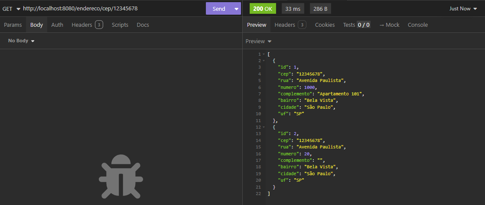

# Nexora

A **Nexora** é uma plataforma tecnológica inovadora, desenvolvida em parceria com a **XP Investimentos**, que integra inteligência artificial, educação financeira personalizada e análise de dados para transformar a forma como as pessoas lidam com seus investimentos e decisões financeiras. Seu escopo abrange:

### Integrantes

- Gabriel Machado Carrara Pimentel — RM99880
- Lourenzo Ramos - RM99951
- Letícia Resina — RM98069
- Vítor Hugo Rodrigues — RM97758

### Inteligência Artificial Aurora

Uma assistente financeira humanizada e inteligente, que acompanha a jornada do usuário de forma contínua. Aurora interpreta perfis de investimento, identifica hábitos de consumo, fornece dicas personalizadas e oferece respostas didáticas e acolhedoras para dúvidas relacionadas ao mercado financeiro.

### Painel Interativo e Visualização de Investimentos

Uma dashboard intuitiva e dinâmica que permite acompanhar gastos, metas, rendimentos e tipos de investimentos com uma experiência visual clara e simplificada, promovendo maior controle e compreensão dos dados financeiros.

### Quiz de Perfil e Educação Financeira

Através de quizzes lúdicos, o usuário descobre seu perfil de investidor e tem acesso a conteúdos educativos sob medida. A plataforma também oferece testes rápidos para consolidar o aprendizado, incentivando o desenvolvimento de habilidades financeiras de forma prática e engajadora.

### Notícias e Insights Automatizados

Aurora entrega resumos inteligentes sobre o mercado financeiro, notícias relevantes e análises simples, filtradas conforme o perfil do usuário e seu nível de conhecimento, promovendo informação sem sobrecarga.

### Objetivos da Nexora

O objetivo principal da Nexora é democratizar o acesso à educação financeira por meio de uma plataforma tecnológica que una inovação, acolhimento e inteligência de dados. A solução busca:

- **Empoderar financeiramente**: Auxiliar o usuário a entender, planejar e executar suas decisões financeiras com autonomia e segurança.
- **Personalizar o aprendizado e os investimentos**: A inteligência artificial adapta o conteúdo e as recomendações conforme a jornada individual, tornando a experiência mais eficiente e próxima.
- **Facilitar o acompanhamento financeiro**: Através da dashboard e análises da Aurora, o usuário monitora seu progresso, identifica padrões e é guiado a melhores escolhas.
- **Simplificar o acesso à informação confiável**: Os resumos automatizados e contextualizados evitam sobrecarga informacional e ajudam o usuário a se manter bem informado com facilidade.
- **Promover uma cultura de bem-estar financeiro**: A Nexora acredita que o equilíbrio financeiro também faz parte da saúde mental e emocional, oferecendo uma experiência educativa, motivadora e acessível.

Sendo uma solução que **informa, analisa, acompanha e empodera**, a Nexora propõe uma nova era no relacionamento das pessoas com suas finanças, por meio de uma abordagem mais humana, visual e personalizada.

## Passo a passo de configuração e execução

1. Após clonar o repositório em seu computador, primeiro vá nesse caminho: "..\src\main\resources" e clique em application.properties

2. Na linha "spring.datasource.username=", após o =, coloque o username que usará em seu banco, como exemplo, root, ficando da seguinte forma: spring.datasource.username=root

3. "spring.datasource.password=",após o =, coloque a senha que seu username utilizada para acessar em seu banco, configurada na instalação. Como exemplo, se você está utilizando o usuário root e na configuração sua senha for "123" ficará da seguinte forma: spring.datasource.password=123

4. Abra seu MySQL e acesse o mesmo username que utilizou no application.properties. Em Query, coloque o seguinte código sql: create database nexora_banco;

## Exemplos de requisição e respostas

Aqui nesse tópico veremos exemplos de requisição e como utilizar em seu computador. Nos testes, utilizamos o Insomnia, mas fique livre para utilizar o Postman se aachar melhor :)

A URL padrão é a seguinte: http://localhost:8080

### Endereco

Requisições para Endereco

#### Metodo Post

1. Para cadastrar um endereço, com a url: http://localhost:8080/endereco

2. JSON que você pode utilizar:

{
"id": 1,
"cep": "12345678",
"rua": "Avenida Paulista",
"numero": 1000,
"complemento": "Apartamento 101",
"bairro": "Bela Vista",
"cidade": "São Paulo",
"uf": "SP"
}

3. O retorno será parecido com isso:

   

#### Metodo Get

1. Para listar todos os endereços, com a url: http://localhost:8080/endereco

2. Para listar com id, com a url: http://localhost:8080/endereco/1

3. Listar por cep, com a url: http://localhost:8080/endereco/cep/12345678

#### Metodo Put

1. Para atualizar, basta informar o id, como exemplo: http://localhost:8080/endereco/1

#### Metodo Delete

1. Para deletar, basta informar o id, como exemplo: http://localhost:8080/endereco/2

Isso irá se aplicar para todas as classes. Confirma a documentação :)

## Tecnologias utilizadas

- Linguagem utilizada: Java com Maven
- Banco de dados: MySQL (produção) e H2 (testes)
- Lombok
- Spring Boot DevTools
- Spring Web
- Spring Data JPA
- Validation
